- [yml syntax](#yml-syntax)
- [Auto-complete](#auto-complete)
- [Run command](#run-command)
  - [Run command and specify working directory](#run-command-and-specify-working-directory)
- [Jobs](#jobs)
  - [Sharing data between jobs](#sharing-data-between-jobs)
  - [By default jobs run in parallel](#by-default-jobs-run-in-parallel)
- [Tools](#tools)
  - [Visualization](#visualization)
- [Team approval workflow](#team-approval-workflow)
- [Giphy generator](#giphy-generator)
- [Custom github actions](#custom-github-actions)
  - [When to create github actions](#when-to-create-github-actions)
  - [Github actions return value](#github-actions-return-value)
  - [Github actions exit code](#github-actions-exit-code)
  - [Github action types](#github-action-types)
    - [JavaScript actions](#javascript-actions)
    - [Docker actions:](#docker-actions)
  - [Github action metadata](#github-action-metadata)
  - [Github actions - communicating with the Host by using logging commands](#github-actions---communicating-with-the-host-by-using-logging-commands)
  - [Public vs. private actions](#public-vs-private-actions)
  - [Github actions - runtime](#github-actions---runtime)
  - [Create JavaScript action using TypeScript](#create-javascript-action-using-typescript)
    - [Setting up the environment](#setting-up-the-environment)
    - [Use created actions](#use-created-actions)
  - [Enable debug level in GitHub actions](#enable-debug-level-in-github-actions)
  - [Create Docker action - auto release milestone](#create-docker-action---auto-release-milestone)
    - [Run action auto release milestone](#run-action-auto-release-milestone)
- [Versioning](#versioning)
- [links](#links)
# yml syntax
https://onlineyamltools.com/convert-yaml-to-json
# Auto-complete

In online github editor make sure that cursor is set in the right place - only then auto complete appears.   

No auto-complete:
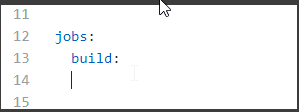  
Auto-complete:
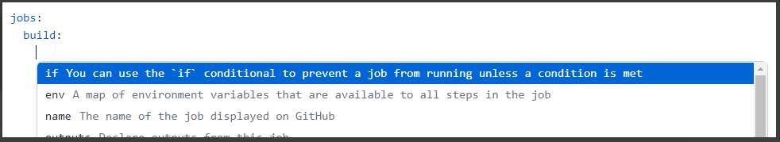
VSCode auto-complete seems to be fine:
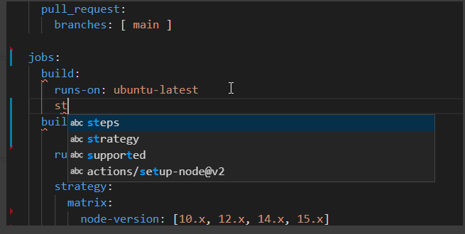


# Run command

This will run only one command npm install and second command npm test will be **silently skipped**:
```
run:
    npm install
    npm test
```
Use ```|``` to run multiple commands:
```
run: |
    npm install
    npm test
```

To run next command only if previous was successful:

```
run: |
    npm install && npm test
```

## Run command and specify working directory
```
run: |
    npm install && npm test
working-directory: |
    ./src/project    
```

# Jobs

## Sharing data between jobs
Each job executes on fresh instance of a virtual environment that`s why jobs do not share anything (like file system). To share artifacts in the same workflow between different jobs use actions upload and download to share to build output which is needed to run the unit tests.
https://docs.github.com/en/actions/guides/storing-workflow-data-as-artifacts

## By default jobs run in parallel

Use ```needs: [job-name]``` to control when to start particular jobs.

# Tools

## Visualization

Use https://github-actions-hero.vercel.app/ and its playground to visualize a workflow.
In this view it is easy to understand which parts are executed in parallel.
https://github-actions-hero.vercel.app/playground   

# Team approval workflow

[approval-workflow.yml](./.github/workflows/approval-workflow.yml])

* easy way to see when enough approvals has been achieved
* branch protections: https://github.com/kicaj29/github-actions-demo/settings/branches
* required review approvals
* matrix build
* save build artifacts
* dedicated test job

# Giphy generator

[giphy-generator.yml](./.github/workflows/giphy-generator.yml)

Using https://developers.giphy.com/dashboard/?create=true create a GIPHY_TOKEN and add it to the secrets: 
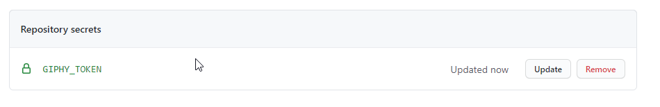

If we will add comment that starts with `/giphy` then selected git will be added by this workflow:

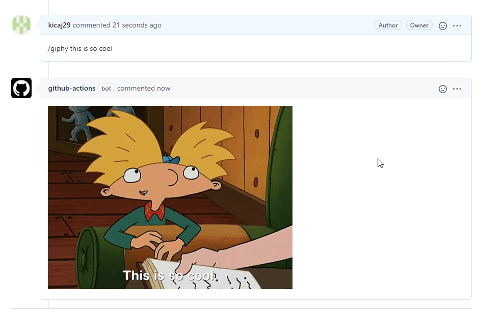

# Custom github actions

Actions run in their own isolated process.

## When to create github actions
When to create github actions (not only re-use reason):

* Control flow: you need more control flow structures then simple if conditions
  
Without github action:

```yml
run: |
    npm install && npm test
working-directory: |
    ./src/project
run: |
    npm install && npm test
working-directory: |
    ./src/another
run: |
    npm install && npm test
working-directory: |
    ./src/yet-another        
```

With github action:

```yml
name: Build
uses: actions/npm-build@v1
with:
    working-directories:
        - src/project
        - src/another
        - src.yet-another
```

* Diagnostic: you need to handle errors to make them easier to diagnose

In workflow it is not possible to specify job that runs only when another job failed:

```yml
jobs:
    install:
        steps:
            - name: Clean install
              run: npm ci
    build:
        needs: install
        steps:
            - name: Build
              run: npm run build
    error:
        steps:
            - name: Handle error
              run: ...
              
```
  
* Complexity  
 
Workflows are declarative and are designed to specify a processes in high level of abstraction. Details should be handled outside of the workflow in actions where are better tools to handle complexity.

For example running a command line with many parameters could be encapsulated in github action:

```yml
- name: Deploy
  env:
    USER: ${{secrets.USER}}
    PWD: ${{secrets.PWD}}
  run: |
    curls -Ss \
    --fail \
    -X POST \
    -T path/to/app.zip \
    -u $USER:$PWD \
    https://example.com/app

```

* Re-use

```yml
jobs:
    build_and_deploy:
        steps:
            - name: Build & Deploy
              uses: ./npm-deploy@v1
    build_and_deploy_another:
        steps:
            - name: Build & Deploy
              uses: ./npm-deploy@v1          
    and_another:
        steps:
            - name: Build & Deploy
              uses: ./npm-deploy@v1              
```

## Github actions return value

```yml
${{ steps id outputs name }}
```
id: step name?   
name: name of the output parameter?

## Github actions exit code

exit 0 - success
exit 1 - fail

The workflow looks on action exit code to decide whether should continue with the next step or should stop with an error.

## Github action types

### JavaScript actions

Pros:
* fast: run directly on the host machine
* development support: easy to integrate with the github environment

Cons:
* require setup: any external dependencies must be installed

### Docker actions:

Pros:
* you can package everything in a single container and the workflow runs it as a unit
* flexible: can run any software
* consistent: action and its dependencies are bundled together so you do not need to worry about installing anything on the host

Cons:
* the are slower then JavaScript actions: it takes time do download and start a container
* linux only

## Github action metadata
metadata: action name, descriptions, input and output params, if it is js or docker action.
Metadata are stored in file ```action.yml```.

```yml
    name: 'My super action'
    description: 'Super description'
    author: 'Jacek'
    inputs:
        parameter-name:
            description: 'An input parameter.'
            required: true # by default params are optional
    outputs:
        output-value-name:
            description: 'A value returned by the action.'

    # for JS actions:
    runs:
        using: 'node12'
        main: 'lib/main.js' # entry point
    # for docker actions:
    runs:
        using: 'docker'
        image: 'Dockerfile'
    # or:
    runs:
        using: 'dockerfile'
        image: 'docker://image:tag'

    # if we want publish an action in the github marketplace:
    branding:
        icon: 'power' # it has to be one of icon offered by http://feathericons.com/
        color: 'yellow'
```

## Github actions - communicating with the Host by using logging commands

Logging commands are instructions for the workflow host that are embedded in the build log.   

WORKFLOW -> BUILD LOG -> HOST

Syntax:
```
::log-command param1=arg,param2=arg::command value
```

Sample logging commands:
```
::set-env name=DEBUG::1
::set-output name=name_of_param::value
::add-path::/path/to/directory                  # adds path to the PATH variable of the host
::debug:: file=name, line=0,col=0::message      # file, line, col are optional
::warning:: file=name, line=0,col=0::message    # file, line, col are optional
::error:: file=name, line=0,col=0::message      # file, line, col are optional
::add-mask::message                             #masked message (for example for secret value)
::add-mask::$VARIABLE                           #masked message (for example for secret value)
::stops-commands::token                         # tells the host to stop interpreting the logs as commands
::token::                                       # tells the host to start interpreting the logs as commands                              
```

Log:
```
Download action repository...
Setting environment variables...
::set-env name=DEBUG::1
[command]program --param=arg
running program with `arg`...
Done
```

```
::set-env name=DEBUG::1
```
means
```yml
env:
    DEBUG:1
```

## Public vs. private actions

* public: workflow and action are stored in different repositories. Create public actions if they will be used in many different workflows.
* private: workflow and action are stored in the same repo
* public and private actions are referenced differently from a workflow:
  * public
    ```yml
    - name: public action
      uses: owner/repo@ref # ref can be commit or tag (version), semantic versioning has to be used, branch name
    ```
    ```yml
    - name: public action
      uses: owner/repo@12az34
    ```
    ```yml
    - name: public action
      uses: owner/repo@v1.2.3
    ```
    ```yml
    - name: public action
      uses: owner/repo@master
    ```
    In case of docker image additionally it is possible to specify docker image url:
    ```yml
    - name: public action
      uses: docker://image:tag
    ```  
  * private
    ```yml
    - name private action
      uses: ./.github/actions/...  # it is convention to use such path
    ```

For repository proper permissions have to be configured:
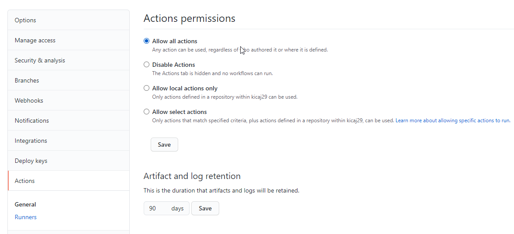   

>NOTE: Public in public action does it mean that source code of the action will be available for all. You can have public action that is hosted in private repository in which case it is only available to other repositories that are part of the same organization.

## Github actions - runtime

* first an event that triggers a workflow is fired
* next all needed actions are downloaded
* temporary workspace directory is created, every time it has different name so we have to refer to it using ```$GITHUB_WORKSPACE```
* to access the workspace actions can use ```upload-artifact``` and ```download-artifact`` actions
* the workspace folder is deleted when the workflow is done
* to check what events triggered the workflow read ```event.json```. This file is also temporary and can be read using ```$GITHUB_EVENT_PATH```.

## Create JavaScript action using TypeScript

An action that creates a GitHub release draft based on a newly created version tag, complete with change log.   

It listens for a github web-hook called ```create``` - it is triggered when someone pushes a new branch or a new tag to repository.   

Next it gets list of commits that happened since last version tag and uses their messages to draft a new github release.

```git describe``` - to find last version tag   
```git logs``` - to find commits between the last version tag and the new one just created

### Setting up the environment

Go to https://github.com/actions and create a new repo from a template.
We will use TypeScript so go to repo https://github.com/actions/typescript-action.
Next click Use this template to create a new repo: 

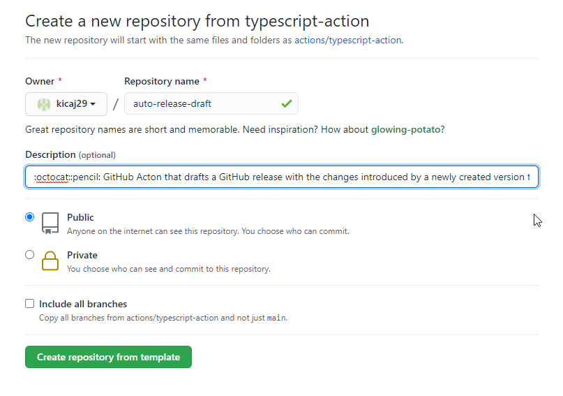

Link to repo with this action: https://github.com/kicaj29/auto-release-draft

Clone the repo and open it with VS code.
Configure default tasks for build (CTRL + SHIFT + B) and test (CTRL + SHIFT + T).
Open command palette to specify what commands(scripts) should be run when we trigger the tasks.

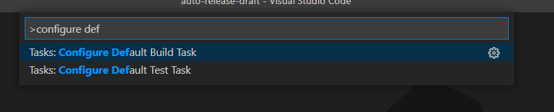

Select ```npm build``` and ```npm test``` for the tasks.
Next run npm install and check that build and tests are ok.

Next configure launching the application. Since it is a github action we cannot simple run it locally outside of the workflow but we can launch test runner and optionally attach node debugger so we can debug our code from the unit tests. 

To do this press `F5` and select `nodejs`:
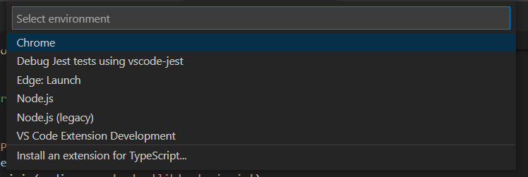
next select:
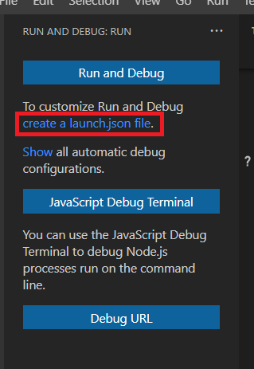.   

A new file `launch.json` will be created which has to be now updated to support jest. To generate configuration for `jest` click `Add Configuration` and select `jest`:
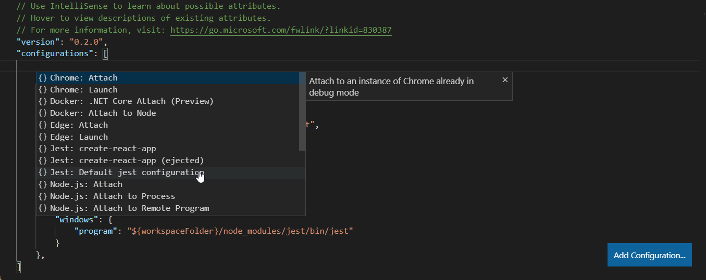

After this you can set breakpoint in a test and press `F5` to start debugging:

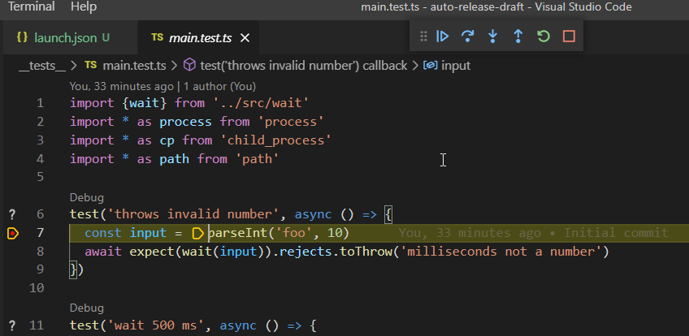

### Use created actions

To use created action in repo: https://github.com/kicaj29/auto-release-draft add tag also in this repo to trigger the action. 

```
git tag -a v1.0.1 -m "This is version 1.0.1"
git tag
git push --tags
```

After pushing the tag a draft release is published:

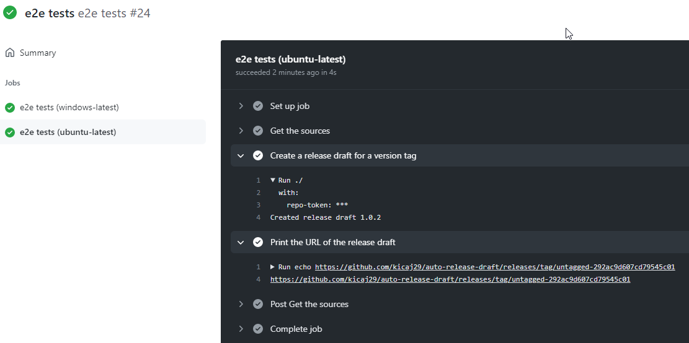

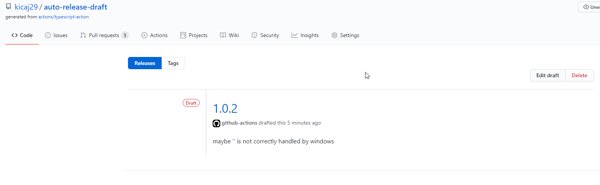

To remove tag:

Local branch:
```
git tag -d v1.0.1
```
Remote branch:
```
git push origin :v1.0.1
```

## Enable debug level in GitHub actions

Create secret `ACTIONS_STEP_DEBUG` with value `true`. Then code like this
```core.debug(`The previous version tag us ${previousTag}`);``` will appear in the log output.

## Create Docker action - auto release milestone

Repository: https://github.com/kicaj29/github-action-docker-auto-release-milestone   

Before merging to the repo we have to make sure that `entrypoint.sh` is marked as executable.
On Windows open bash terminal and execute:

```
git add --chmod=+x -- entrypoint.sh
```
Next commit and push the change.

### Run action auto release milestone

* create a milestone in github
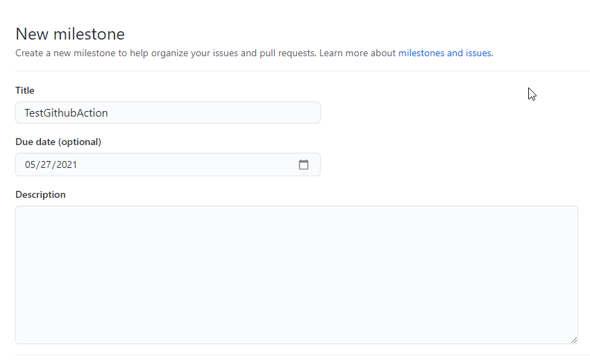

* create issues in the milestone
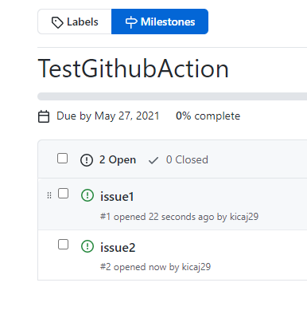

* close both issues
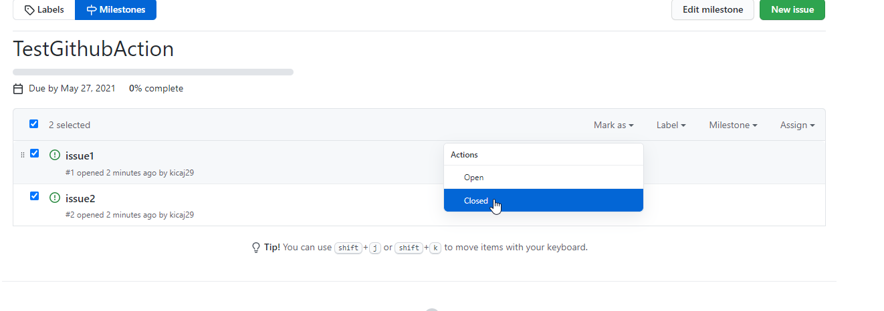

* in edit view close the milestone
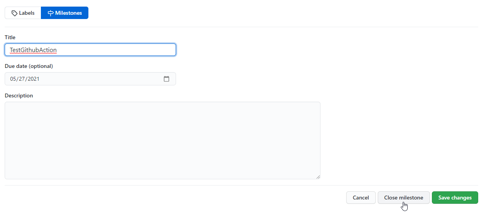

Next the github workflow should generate draft release for the closed milestone:

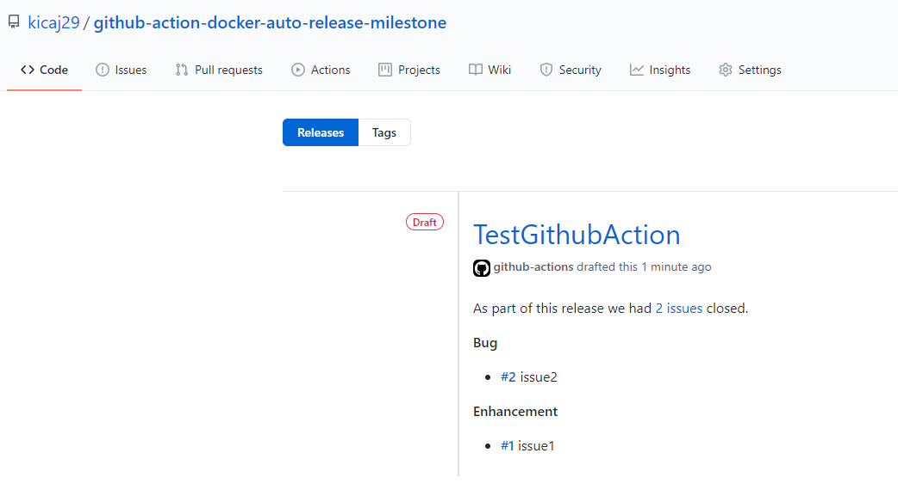

# Versioning

First semantic versioning should be used when we create tags.

It is recommended to refer to actions by using floating versioning, for example:

```
uses: actions/checkout@v2
```

then for example when a new version with some bug fixes is available let`s say v2.0.1 it will be automatically used by the workflow.

# links
https://github.com/a-a-ron/github-actions-course-template   
http://github.com/marketplace   
https://github.com/marketplace/actions/label-approved-pull-requests   
https://github.com/marketplace/actions/giphy-generator   
https://lab.github.com   
https://github.com/nektos/act (Run your GitHub Actions locally)   

